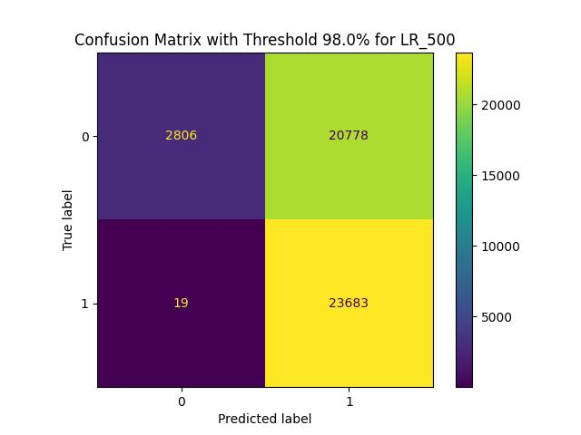
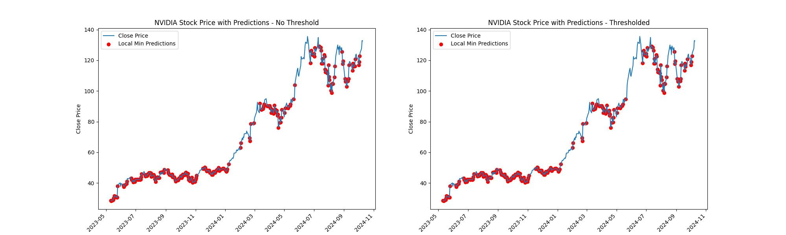

# Introduction
This research is about somewhat recreating this article: https://medium.com/analytics-vidhya/how-im-using-machine-learning-to-trade-in-the-stock-market-3ba981a2ffc2

The article is about using machine learning to predict stock prices. The author uses a simple feed forward neural network to predict the stock prices. The author uses the past 30 days of stock prices to predict the stock price of the next day. 

In this research I will try to recreate the author's work using the same steps and see how well the model performs on the test data. 

# Table of Contents
- [Data](#data)
  - [Preprocess Data for Training](#preprocess-data-for-training)
- [Model](#model)
- [Evaluation](#evaluation)
  - [Logistic Regression Grid Search Results](#logistic-regression-grid-search-results)
    - [Example Usage](#example-usage)
    - [Grid Search Results](#grid-search-results)
    - [Classification Report](#classification-report)
    - [Classification Report - Thresholded](#classification-report---thresholded)
- [Results](#results)
  - [Confusion Matrix Thresholded using relative Volume](#confusion-matrix-thresholded-using-relative-volume)
  - [Using the model on NVDA data](#using-the-model-on-nvda-data)
- [References](#references)

# Data
The data is from Yahoo finance. To train the model all tickers from S&P 500 are used.

## Preprocess Data for training

- Removed rows with missing or NaN values to ensure the dataset is complete.
- Filtered out irrelevant columns that are not needed for model training.
- Created new features such as `normalized_value`, which normalizes the stock prices.
- Added a `target` column with `0` for row being local min and `1` for being local max

# Model
- In this notebook we try and evaluate the Logistic Regression model.
- Two Models are tested, one using relative Volume instead of normal and the other using normal.


# Evaluation
We evualate the model by taking a percentage of the data out of the training set (15%)

## Logistic Regression Grid Search Results

### Example Usage
```python
lr_500 = LR_training('LR_500_normal', train_data=train_df, save_path=None, test_size=0.15, threshold=0.98)
```
### Grid Search Results
- Best parameters found: {'C': 100, 'max_iter': 300, 'solver': 'saga'}
- Best estimator: LogisticRegression(C=100, max_iter=300, solver='saga')
- Logistic regression model score: 0.876136700080362

### Classification report
              precision    recall  f1-score   support

         0.0       0.87      0.88      0.88     23584
         1.0       0.88      0.87      0.88     23702

    accuracy                           0.88     47286
   macro avg       0.88      0.88      0.88     47286
weighted avg       0.88      0.88      0.88     47286

### Classification report - Thresholded

              precision    recall  f1-score   support

         0.0       0.99      0.12      0.21     23584
         1.0       0.53      1.00      0.69     23702

    accuracy                           0.56     47286
   macro avg       0.76      0.56      0.45     47286
weighted avg       0.76      0.56      0.45     47286

# Results
## Confusion Matrix Thresholded using relative Volume


## Using the model on NVDA data


# References
1. https://medium.com/analytics-vidhya/how-im-using-machine-learning-to-trade-in-the-stock-market-3ba981a2ffc2

